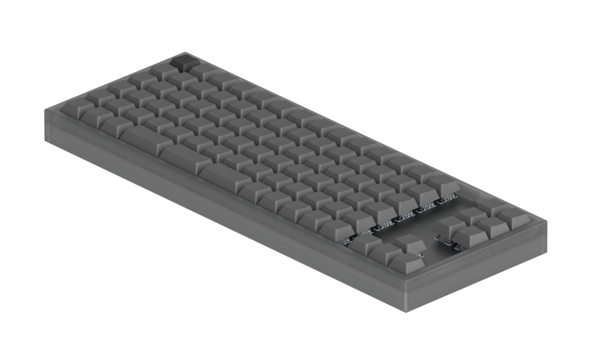
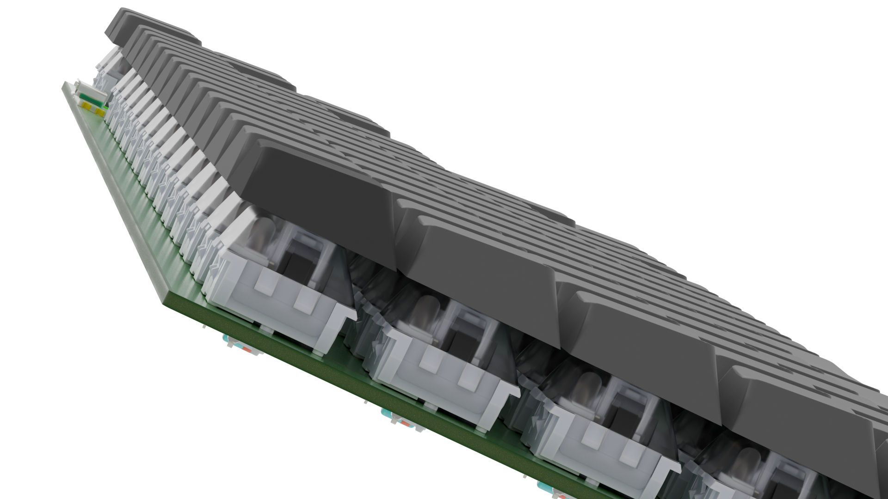
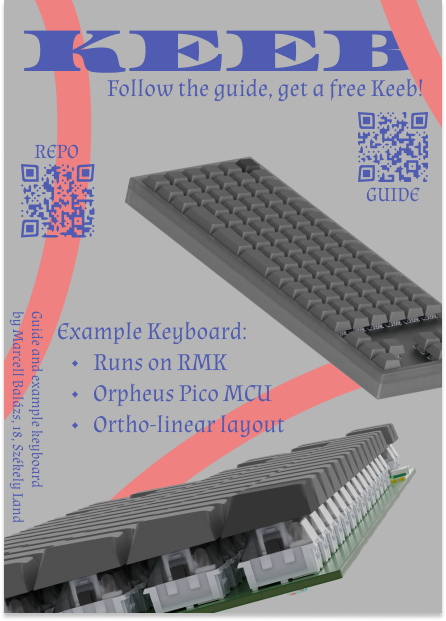

# KEEB

A Hack Club you-ship-we-ship project. Follow the guide, we ship the parts, you build a mechanical keyboard. With an example keyboard.

Check out the [website](https://keeb.hackclub.com/) with the guide!

## Why

This project exists to help beginners make their first electronics project/keyboard

## Example keyboard features

- Runs on RMK, a keyboard firmware written in rust
- Plate mounted
- Ortho-linear layout

## Example keyboard PCB

## Example keyboard BOM

|Item          |Price per unit|Nr of units|Total price|Link                                                 |
|--------------|--------------|-----------|-----------|-----------------------------------------------------|
|Switches      |$0.42         |100        |$42.04     |https://www.aliexpress.com/item/1005010149555052.html|
|Keycap set    |$29.72        |1          |$29.72     |https://www.aliexpress.com/item/1005005216170590.html|
|Stabilizer set|$9.49         |1          |$9.49      |https://www.aliexpress.com/item/1005001686299616.html|
|PCB           |$4            |5          |$20        |https://jlcpcb.com/                                  |
|              |              |Total:     |$101.25    |                                                     |

## Zine

## Docs

Add or edit markdown files in `src/content/docs/`. Each file needs frontmatter with `title`, `description`, and `order` fields. They'll automatically appear in the docs sidebar.

